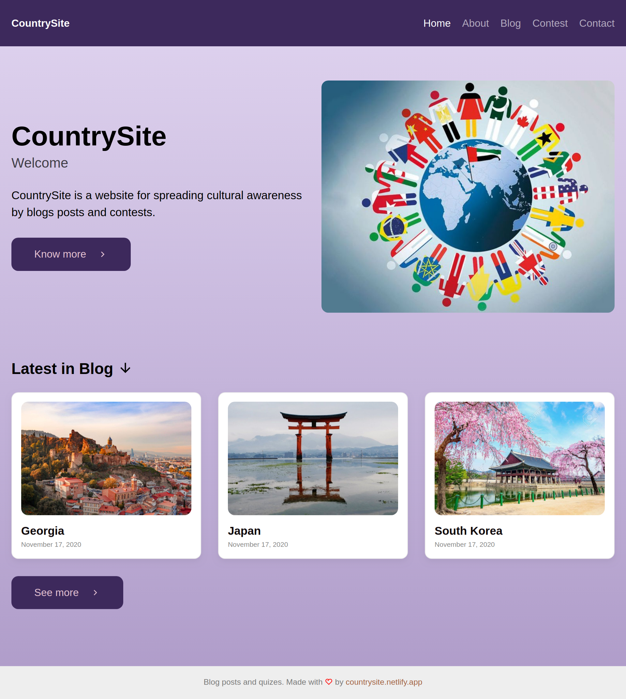

* [Introduction](#introduction)
* [Installation](#installation)
* [Building](#building)
* [Testing](#testing)

# Introduction

This repository holds source code for [CountrySite](https://countrysite.netlify.app/) website. CountrySite is for spreading knowledge and cultural awareness by blog posts and engaging users by fun activities such as monthly contests. For more information
please visit the website.

# Installation

- Clone the repository with HTTPS

    `https://github.com/bagashvilit/countrysite.netlify.app.git`

- Clone the repository with SSH

    `git@github.com:bagashvilit/countrysite.netlify.app.git`

# Building

This project uses Gatsby for building the website. Please see the [link](https://www.gatsbyjs.com/docs/gatsby-cli/#:~:text=The%20Gatsby%20CLI%20is%20available,%2D%2Dhelp%20for%20full%20help.) for more information on how to install Gatsby.

Alternatively all the dependencies required for this project may be installed from `package.json` by running `npm install`.

To build the website you may use the command defined under the scripts in `package.json`.

`npm run build`

You may also run:

`gatsby develop`

And the website should be runnign on `http://localhost:8000`, and the changes in the source code should be reflected in real time.

# testing

To lint the source code the project uses Prettier code formater. The command is also defined in `package.json` and may be used as follows:

`npm run format`
