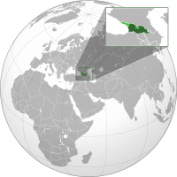
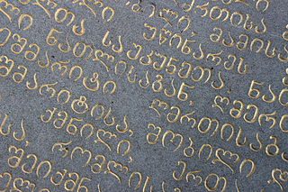
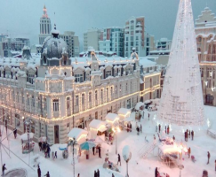

## General statistics

- Capital: Tbilisi
- Population: 3,716,858
- National language: Georgian
- Currency: Georgian Lari

## Location on map

## Culture and interesting facts

### Georgia is the only country where they speak Georgian

Georgian language has it's own unique script. Georgian script doesn't belong to any language families. Georgian script has three alphabets. But nowadays the most commonly use one is "Mkhedruli". There are only four million native Georgian speakers, but the language has at least 18 different dialects.

### Georgia has Europe's highest settlement

Bochorna is a town in the Caucasus mountains. It is considered as the highest continuously inhabted settlement in Europe. It's altitude is 7,694 feet above sea level. It is also in the top 30 settlements in the world by its altitude([Culture trip](https://theculturetrip.com/europe/georgia/articles/13-interesting-facts-about-georgia/)).

### Georgia celebrates new year twice

Georgians once celebrate New Year on January 1st. Next it is celebrated on January 13th. According to the Eastern Orthodox Calendar New Year date is January 13th, in Georgia that is called "Old" New Year. Georgians also celebrate Christmas on January 7th, which is common among Orthodox Christians.
