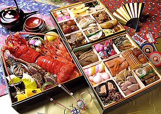
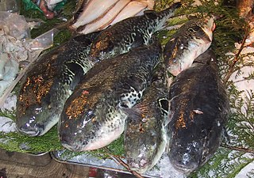

## General statistics

- Capital: Tokyo
- Population: 125,960,000
- National language: Japanese
- Currency: Japanese Yen

## Location on the map

## Interesting facts

### Japan is the only country with Emperor

Japan has the longest continuous monarchy. The current emperror is [Naruhito](https://www.pri.org/stories/2019-04-25/japan-s-next-emperor-modern-multilingual-environmentalist). He acended to throne in may 2019, after former emperor Akihito [abdicated](https://www.pri.org/stories/2019-04-25/japan-s-next-emperor-modern-multilingual-environmentalist).

### Japanese cuisine was mostly vegetarian until 19th century

The Buddhist laws passed in 7th century prohibited eating meat, excluding fish and birds. In 19th century as western ideals became popular in Japan, the Meiji emperor broke the hundreds of years old tradition ([follow link](https://japanology.org/2019/04/20-facts-on-japanese-culture/)).

### Deadly poisonous fish: Fugu(Puffer fish)

Fugu is a Japanese fish that has deadly poison in its organs and blood. Serving it is only allowed under a special licsence, after training for about three years. Still every year there are some cases of poisoning by Fugu ([follow link](https://japanology.org/2019/04/20-facts-on-japanese-culture/)).

