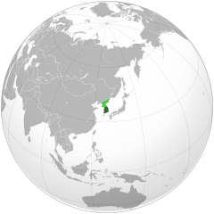
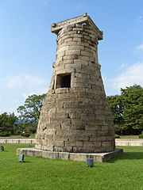

## General statistics

- Capital: Seoul
- Population: 51.64 million
- National language: South Korean
- Currency: South Korean won

## Location on the map

## Interesting facts

### South Koreans'calculate their age differently

South Koreans calculate their age differently compared tot he rest of the world. Once the baby is born they are already considered as 1 year old. They celebrate 100th day after the baby is born and then celebrate their 2nd birthday on following Lunar New Year([follow link](https://worldstrides.com/blog/2018/02/11-facts-about-south-korea/)).

### Required by law to use Internet Explorer for ecommerce

The law passed in late 1990s requires South Koreans to use Internet Explorer for ecommerce. Government online system lets merchants identify the customers with digital certificate, after they enter their personal information. The architecture of the system is still same and relies on Active X control, requiring Internet Explorer ([follow link](https://worldstrides.com/blog/2018/02/11-facts-about-south-korea/)).

### Cheomseongdae Observatory

The world's first astronomical lab, Cheomseongdae Observatory, is located in South Korea. It was built in 7th century. In korean Cheomseongdae means star-gazing ([follow link](https://worldstrides.com/blog/2018/02/11-facts-about-south-korea/)).